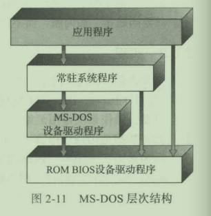
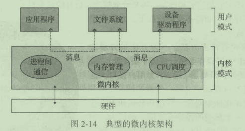

本文总结了《操作系统概念》中的知识点，以便查阅。

<!-- More -->

## 第二章 操作系统结构

操作系统的服务：主要包括以下功能：

+ 用户界面
+ 程序执行
+ IO 操作
+ 文件系统操作
+ 通信：通过共享内存或者消息交换实现
+ 错误检测
+ 资源分配
+ 记账：记录用户使用资源类型和数量
+ 保护和安全

系统调用：提供操作系统的服务调用接口，该部分通常使用 C 或者 C++ 实现，当然，对某些底层硬件操作可能需要使用汇编。向操作系统传参的方法有：寄存器传参，栈传参，表传参。

系统调用类型：进程控制，文件管理，设备管理，信息维护，通信，保护。

操作系统的结构：

+ 简单结构：如 MS-DOS，并没有仔细划分为模块

  

+ 分层方法：每层上调用的接口是不同的，用于区分用户接口和不同等级的系统接口

  

+ 微内核：主要功能在于为客户端程序和运行在用户空间的各种服务提供通信，通信是通过消息传递实现的

  

+ 模块：最佳方法是可加载的内核模块，常见于现代 Linux 系统中

  

操作系统的引导：加载内核以启动计算机的过程，称为系统引导。大多数的操作系统都有一个引导程序，改程序能够定位内核，并将其加载到内存以开始执行。当 CPU 收到一个重置事件时，指令寄存器会加载某个预先定义的内存位置，并从该位置执行，该位置实际上就是引导程序所在位置。

