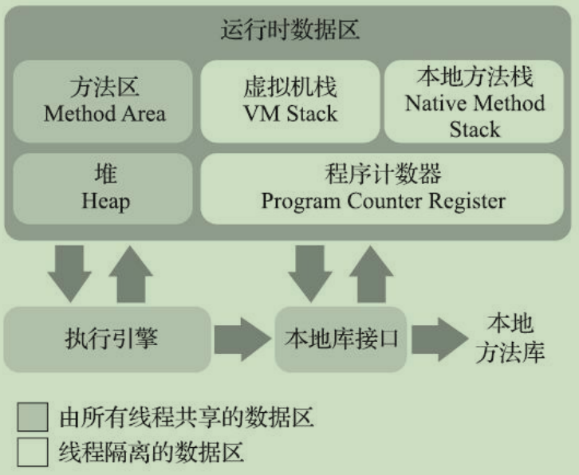

本文主要整理由周志明编写的《深入理解Java虚拟机》第三版书籍的整理笔记。

<!-- More -->

## 第二章 Java内存区域与内存溢出异常

运行时数据区域：

+ 程序计数器：通过改变其值来获取下一条需要执行的字节码指令。
+ 虚拟机栈：每个方法执行的时候会创建一个栈帧，用于存储局部变量，方法出口等信息。
+ 本地方法栈：同虚拟机栈，只不过本地方法栈是为本地方法服务的。
+ 堆：几乎所有的对象实例都会在这里面分配。
+ 方法区：用于存储已被虚拟机加载的类型信息、常量、静态变量、即时编译器编译后的代码缓存等数据。
  + 运行时常量池：是方法区的一部分，常量池表，Class文件中描述信息会放在此处。

直接内存：在JDK 1.4中新加入了NIO（New Input/Output）类，引入了一种基于通道（Channel）与缓冲区（Buffer）的I/O方式，它可以使用Native函数库直接分配堆外内存，然后通过一个存储在Java堆里面的DirectByteBuffer对象作为这块内存的引用进行操作。

对象的创建：当Java虚拟机遇到一条字节码new指令时，首先将去检查这个指令的参数是否能在常量池中定位到一个类的符号引用，并且检查这个符号引用代表的类是否已被加载、解析和初始化过。如果没有，那必须先执行相应的类加载过程。在类加载检查通过后，接下来虚拟机将为新生对象分配内存。分配方式有指针碰撞和空闲列表两种方式。接下来，就需要执行构造函数了，也就是Class文件中的`<init>()`方法。

对象的内存布局：对象在堆里面的内存布局分为三部分：对象头，实例数据，对齐填充

+ 对象头：第一类用于存储对象自身的运行时数据，如哈希码，GC分代年龄等，第二部分是类型指针，用于确定该对象是那个类的实例。
+ 实例数据：从父类继承和该类中定义的数据。
+ 对齐填充：用于保证对象是8字节对齐的。

对象的访问定位：主流的方式有两种，使用句柄或者使用直接指针，HotSpot虚拟机使用直接指针方式。

+ 句柄：好处就是reference中存储的是稳定句柄地址，在对象被移动（垃圾收集时移动对象是非常普遍的行为）时只会改变句柄中的实例数据指针，而referrence不用修改

  

+ 直接指针：好处就是速度更快，它节省了一次指针定位的时间开销

  

