本文主要整理由周志明编写的《深入理解Java虚拟机》第三版书籍的整理笔记。

<!-- More -->


## 第二章 Java内存区域与内存溢出异常

运行时数据区域：


+ 程序计数器：通过改变其值来获取下一条需要执行的字节码指令。
+ 虚拟机栈：每个方法执行的时候会创建一个栈帧，用于存储局部变量，方法出口等信息。
+ 本地方法栈：同虚拟机栈，只不过本地方法栈是为本地方法服务的。
+ 堆：几乎所有的对象实例都会在这里面分配。
+ 方法区：用于存储已被虚拟机加载的类型信息、常量、静态变量、即时编译器编译后的代码缓存等数据。
  + 运行时常量池：是方法区的一部分，常量池表，Class文件中描述信息会放在此处。

直接内存：在JDK 1.4中新加入了NIO（New Input/Output）类，引入了一种基于通道（Channel）与缓冲区（Buffer）的I/O方式，它可以使用Native函数库直接分配堆外内存，然后通过一个存储在Java堆里面的DirectByteBuffer对象作为这块内存的引用进行操作。

对象的创建：当Java虚拟机遇到一条字节码new指令时，首先将去检查这个指令的参数是否能在常量池中定位到一个类的符号引用，并且检查这个符号引用代表的类是否已被加载、解析和初始化过。如果没有，那必须先执行相应的类加载过程。在类加载检查通过后，接下来虚拟机将为新生对象分配内存。分配方式有指针碰撞和空闲列表两种方式。接下来，就需要执行构造函数了，也就是Class文件中的`<init>()`方法。

对象的内存布局：对象在堆里面的内存布局分为三部分：对象头，实例数据，对齐填充

+ 对象头：第一类用于存储对象自身的运行时数据，如哈希码，GC分代年龄等，第二部分是类型指针，用于确定该对象是那个类的实例。
+ 实例数据：从父类继承和该类中定义的数据。
+ 对齐填充：用于保证对象是8字节对齐的。

对象的访问定位：主流的方式有两种，使用句柄或者使用直接指针，HotSpot虚拟机使用直接指针方式。

+ 句柄：好处就是reference中存储的是稳定句柄地址，在对象被移动（垃圾收集时移动对象是非常普遍的行为）时只会改变句柄中的实例数据指针，而referrence不用修改

  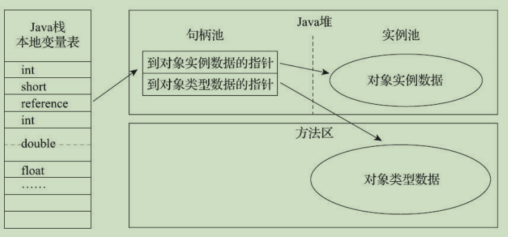

+ 直接指针：好处就是速度更快，它节省了一次指针定位的时间开销

  


## 第三章 垃圾收集器与内存分配策略

引用计数算法：在对象中添加一个引用计数器，每当有一个地方引用它时，计数器值就加一；当引用失效时，计数器值就减一；任何时刻计数器为零的对象就是不可能再被使用的。该方法不能检测循环引用。

可达性分析算法：基本思路就是通过一系列称为“GC Roots”的根对象作为起始节点集，从这些节点开始，根据引用关系向下搜索，搜索过程所走过的路径称为“引用链”（Reference Chain），如果某个对象到GC Roots间没有任何引用链相连，或者用图论的话来说就是从GC Roots到这个对象不可达时，则证明此对象是不可能再被使用的。在Java技术体系中，GC Roots对象有：

+ 虚拟机栈中引用的对象
+ 在方法区中类静态属性引用的对象，常量引用的对象
+ 同步锁持有的对象

引用类型：在JDK 1.2版之后，Java对引用的概念进行了扩充，有以下几类

+ 强引用：最传统的“引用”的定义，是指在程序代码之中普遍存在的引用赋值
+ 软引用：来描述一些还有用，但非必须的对象。只被软引用关联着的对象，在系统将要发生内存溢出异常前，会把这些对象列进回收范围之中进行第二次回收
+ 弱引用：也是用来描述那些非必须对象，但是它的强度比软引用更弱一些，被弱引用关联的对象只能生存到下一次垃圾收集发生为止
+ 虚引用：最弱的一种引用关系，一个对象是否有虚引用的存在，完全不会对其生存时间构成影响，也无法通过虚引用来取得一个对象实例，为一个对象设置虚引用关联的唯一目的只是为了能在这个对象被收集器回收时收到一个系统通知

对象自我拯救：即使在可达性分析算法中判定为不可达的对象，这时候它们暂时还处于“缓刑”阶段，要真正宣告一个对象死亡，至少要经历两次标记过程：如果对象在进行可达性分析后发现没有与GC Roots相连接的引用链，那它将会被第一次标记，随后进行一次筛选，筛选的条件是此对象是否有必要执行finalize()方法。假如对象没有覆盖finalize()方法，或者finalize()方法已经被虚拟机调用过，那么虚拟机将这两种情况都视为“没有必要执行”。如果这个对象被判定为确有必要执行finalize()方法，那么该对象将会被放置在一个名为F-Queue的队列之中，并在稍后由一条由虚拟机自动建立的、低调度优先级的Finalizer线程去执行它们的finalize()方法。finalize()方法是对象逃脱死亡命运的最后一次机会，稍后收集器将对F-Queue中的对象进行第二次小规模的标记，如果对象要在finalize()中成功拯救自己，即只要重新与引用链上的任何一个对象建立关联即可，譬如把自己（this关键字）赋值给某个类变量或者对象的成员变量，那在第二次标记时它将被移出“即将回收”的集合。

回收方法区：在Java堆中，尤其是在新生代中，对常规应用进行一次垃圾收集通常可以回收70%至99%的内存空间，相比之下，方法区回收囿于苛刻的判定条件，其区域垃圾收集的回收成果往往远低于此。方法区的垃圾收集主要回收两部分内容：废弃的常量和不再使用的类型。

分代收集理论：建立在三个假说之上：

1. 弱分代假说：绝大多数对象都是朝生夕灭的。
2. 强分代假说：熬过越多次垃圾收集过程的对象就越难以消亡。
3. 跨代引用假说：跨代引用相对于同代引用来说仅占极少数。

前两个假说表明如果一个区域中大多数对象都是朝生夕灭，难以熬过垃圾收集过程的话，那么把它们集中放在一起，每次回收时只关注如何保留少量存活而不是去标记那些大量将要被回收的对象，就能以较低代价回收到大量的空间；如果剩下的都是难以消亡的对象，那把它们集中放在一块，虚拟机便可以使用较低的频率来回收这个区域，这就同时兼顾了垃圾收集的时间开销和内存的空间有效利用；第三点表明我们就不应再为了少量的跨代引用去扫描整个老年代，也不必浪费空间专门记录每一个对象是否存在及存在哪些跨代引用。

标记-清除算法：首先标记出所有需要回收的对象，在标记完成后，统一回收掉所有被标记的对象。缺点：第一个是执行效率不稳定，如果Java堆中包含大量对象，而且其中大部分是需要被回收的，这时必须进行大量标记和清除的动作，导致标记和清除两个过程的执行效率都随对象数量增长而降低；第二个是内存空间的碎片化问题，标记、清除之后会产生大量不连续的内存碎片，空间碎片太多可能会导致当以后在程序运行过程中需要分配较大对象时无法找到足够的连续内存而不得不提前触发另一次垃圾收集动作。

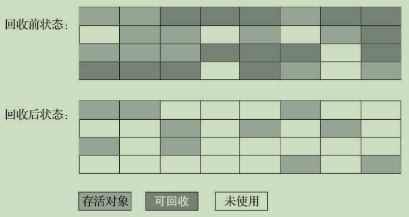

标记-复制算法：将可用内存按容量划分为大小相等的两块，每次只使用其中的一块。当这一块的内存用完了，就将还存活着的对象复制到另外一块上面，然后再把已使用过的内存空间一次清理掉。如果内存中多数对象都是存活的，这种算法将会产生大量的内存间复制的开销，但对于多数对象都是可回收的情况，算法需要复制的就是占少数的存活对象，而且每次都是针对整个半区进行内存回收，分配内存时也就不用考虑有空间碎片的复杂情况，只要移动堆顶指针，按顺序分配即可。这样实现简单，运行高效，不过其缺陷也显而易见，这种复制回收算法的代价是将可用内存缩小为了原来的一半，空间浪费未免太多了一点。


> 新生代存在朝生夕灭现象，存活者大概只有 10% 左右，内存空间比可以分为 8 ：1

标记-整理算法：其中的标记过程仍然与“标记-清除”算法一样，但后续步骤不是直接对可回收对象进行清理，而是让所有存活的对象都向内存空间一端移动，然后直接清理掉边界以外的内存。标记-清除算法与标记-整理算法的本质差异在于前者是一种非移动式的回收算法，而后者是移动式的。是否移动回收后的存活对象是一项优缺点并存的风险决策：在老年代这种每次回收都有大量对象存活区域，移动存活对象并更新所有引用这些对象的地方将会是一种极为负重的操作，而且这种对象移动操作必须全程暂停用户应用程序才能进行；而不移动对象的时候又存在空间碎片化问题。


经典垃圾收集器：

+ Serial 收集器：是一个单线程工作的收集器，但它的“单线程”的意义并不仅仅是说明它只会使用一个处理器或一条收集线程去完成垃圾收集工作，更重要的是强调在它进行垃圾收集时，必须暂停其他所有工作线程，直到它收集结束。优点是简单，内存消耗低；缺点是需要暂停其他工作线程。

  

+ ParNew 收集器：实质上是Serial收集器的多线程并行版本。

  

+ Parallel Scavenge收集器：也是一款新生代收集器，它同样是基于标记-复制算法实现的收集器，也是能够并行收集的多线程收集器，它的特点在于它的关注点与其他收集器不同，CMS等收集器的关注点是尽可能地缩短垃圾收集时用户线程的停顿时间，而Parallel Scavenge收集器的目标则是达到一个可控制的吞吐量。

+ Serial Old收集器：Serial收集器的老年代版本，它同样是一个单线程收集器，使用标记-整理算法。

  

+ Parallel Old收集器：是Parallel Scavenge收集器的老年代版本，支持多线程并发收集，基于标记-整理算法实现。吞吐量优先收集器。

  

+ CMS（Concurrent Mark Sweep）收集器：是一种以获取最短回收停顿时间为目标的收集器。很大一部分Java应用基于 B/S 实现，这类应用通常都会较为关注服务的响应速度，希望系统停顿时间尽可能短，以给用户带来良好的交互体验。CMS收集器就非常符合这类应用的需求。收集过程如下：

  1. 初始标记：记仅仅只是标记一下GC Roots能直接关联到的对象，速度很快；Stop the World
  2. 并发标记：是从GC Roots的直接关联对象开始遍历整个对象图的过程，这个过程耗时较长但是不需要停顿用户线程，可以与垃圾收集线程一起并发运行；
  3. 重新标记：则是为了修正并发标记期间，因用户程序继续运作而导致标记产生变动的那一部分对象的标记记录；Stop the World
  4. 并发清除：清理删除掉标记阶段判断的已经死亡的对象，由于不需要移动存活对象，所以这个阶段也是可以与用户线程同时并发的。

  

  优点：并发收集，低停顿；缺点：对处理器资源敏感（并发阶段会导致应用程序变慢，降低总吞吐量），无法处理“浮动垃圾”（并发清理阶段，用户线程是还在继续运行的，程序在运行自然就还会伴随有新的垃圾对象不断产生），基于标记清除，空间碎片化问题严重。

+ Garbage First收集器：简称 G1 收集器，在G1收集器出现之前的所有其他收集器，包括CMS在内，垃圾收集的目标范围要么是整个新生代（Minor GC），要么就是整个老年代（Major GC），再要么就是整个Java堆（Full GC）。而G1跳出了这个樊笼，它可以面向堆内存任何部分来组成回收集（Collection Set，一般简称CSet）进行回收，衡量标准不再是它属于哪个分代，而是哪块内存中存放的垃圾数量最多，回收收益最大，这就是G1收集器的Mixed GC模式。G1不再坚持固定大小以及固定数量的分代区域划分，而是把连续的Java堆划分为多个大小相等的独立区域（Region），每一个Region都可以根据需要，扮演新生代的Eden空间、Survivor空间，或者老年代空间。收集器能够对扮演不同角色的Region采用不同的策略去处理，从而获取更好的收集效果。G1收集器过程：

  1. 初始标记：仅仅只是标记一下GC Roots能直接关联到的对象，需要短暂停顿
  2. 并发标记：从GC Root开始对堆中对象进行可达性分析，递归扫描整个堆里的对象图，找出要回收的对象，这阶段耗时较长，但可与用户程序并发执行。
  3. 最终标记：对用户线程做另一个短暂的暂停，用于处理并发阶段结束后仍遗留下来的最后那少量的SATB记录。
  4. 筛选回收：负责更新Region的统计数据，对各个Region的回收价值和成本进行排序，根据用户所期望的停顿时间来制定回收计划，可以自由选择任意多个Region构成回收集，然后把决定回收的那一部分Region的存活对象复制到空的Region中，再清理掉整个旧Region的全部空间。这里的操作涉及存活对象的移动，是必须暂停用户线程，由多条收集器线程并行完成的。

  

低延迟垃圾收集器：HotSpot的垃圾收集器从Serial发展到CMS再到G1，经历了逾二十年时间，经过了数百上千万台服务器上的应用实践，已经被淬炼得相当成熟了，不过它们距离“完美”还是很遥远。衡量垃圾收集器的三项最重要的指标是：内存占用（Footprint）、吞吐量（Throughput）和延迟（Latency），三者共同构成了一个“不可能三角”。图3-14中浅色阶段表示必须挂起用户线程，深色表示收集器线程与用户线程是并发工作的。


+ Shenandoah收集器：Shenandoah作为第一款不由Oracle（包括以前的Sun）公司的虚拟机团队所领导开发的HotSpot垃圾收集器，不可避免地会受到一些来自“官方”的排挤。Shenandoah反而更像是G1的下一代继承者，它们两者有着相似的堆内存布局，在初始标记、并发标记等许多阶段的处理思路上都高度一致，甚至还直接共享了一部分实现代码。虽然Shenandoah也是使用基于Region的堆内存布局，同样有着用于存放大对象的Humongous Region，默认的回收策略也同样是优先处理回收价值最大的Region……但在管理堆内存方面，它与G1至少有三个明显的不同之处，最重要的当然是支持并发的整理算法，G1的回收阶段是可以多线程并行的，但却不能与用户线程并发；其次，Shenandoah（目前）是默认不使用分代收集的；Shenandoah摒弃了在G1中耗费大量内存和计算资源去维护的记忆集，改用名为“连接矩阵”（Connection Matrix）的全局数据结构来记录跨Region的引用关系，降低了处理跨代指针时的记忆集维护消耗。大致上可以分为九个阶段：初始标记，并发标记，最终标记，并发清理，并发回收，初始引用更新，最终引用更新，并发清理。

  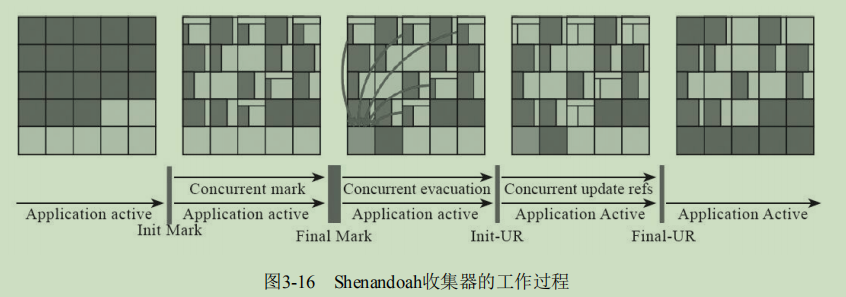

  最重要三个阶段是并发标记、并发回收、并发引用更新。

+ ZCG收集器：Z Garbage Collector，是由Oracle公司研发的。ZGC和Shenandoah的目标是高度相似的，都希望在尽可能对吞吐量影响不太大的前提下[2]，实现在任意堆内存大小下都可以把垃圾收集的停顿时间限制在十毫秒以内的低延迟。ZGC也采用基于Region的堆内存布局，但与它们不同的是，ZGC的Region（在一些官方资料中将它称为Page或者ZPage，本章为行文一致继续称为Region）具有动态性——动态创建和销毁，以及动态的区域容量大小。Shenandoah使用转发指针和读屏障来实现并发整理，ZGC虽然同样用到了读屏障，但用的却是一条与Shenandoah完全不同，更加复杂精巧的解题思路：染色指针技术。分为四个阶段：并发标记，并发预备重分配，并发重分配，并发重映射。

  

Epsilon收集器：这是一款以不能够进行垃圾收集为“卖点”的垃圾收集器，要负责堆的管理与布局、对象的分配、与解释器的协作、与编译器的协作、与监控子系统协作等职责，其中至少堆的管理和对象的分配这部分功能是Java虚拟机能够正常运作的必要支持，是一个最小化功能的垃圾收集器也必须实现的内容。对弈比较小的应用有用武之地。


## 第四章 虚拟机性能监控、故障处理工具

基础故障处理工具：

+ jps：虚拟机进程状况工具，可以列出正在运行的虚拟机进程，并显示虚拟机执行主类（Main Class，main()函数所在的类）名称以及这些进程的本地虚拟机唯一ID（LVMID，Local Virtual Machine Identifier）。
+ jstat（JVM Statistics Monitoring Tool）：用于监视虚拟机各种运行状态信息的命令行工具，可以显示本地或者远程[1]虚拟机进程中的类加载、内存、垃圾收集、即时编译等运行时数据。
+ jinfo（Configuration Info for Java）：实时查看和调整虚拟机各项参数。
+ jmap（Memory Map for Java）：用于生成堆转储快照（一般称为heapdump或dump文件）。
+ jhat（JVM Heap Analysis Tool）：与jmap搭配使用，来分析jmap生成的堆转储快照。
+ jstack（Stack Trace for Java）：用于生成虚拟机当前时刻的线程快照（一般称为threaddump或者 javacore文件），线程快照就是当前虚拟机内每一条线程正在执行的方法堆栈的集合，生成线程快照的目的通常是定位线程出现长时间停顿的原因，如线程间死锁、死循环。

可视化故障处理工具：

+ JHSDB：基于服务性代理的调试工具
+ JConsole：Java监视与管理控制台
+ VisualVM：多合-故障处理工具，是功能最强大的运行监视和故障处理程序之一
+ JMC（Java Mission Control）：可持续在线的监控工具


## 第六章 类文件结构

平台无关性：字节码(Byte Code)文件是构成平台无关性的基石，Java 虚拟机只接受字节码文件，而不管这些文件是怎么的得到的，这就为其他语言可以运行在 Java 虚拟机上提供了基础。

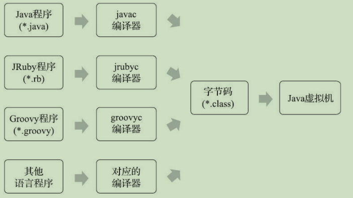

Class类文件的结构：

+ Class文件是一组以8个字节为基础单位的二进制流，并且按照 Big-Endian 来排列位数较大的数。

+ Class文件采用一种类似C语言的言结构体的伪结构来存储数据，这种伪结构中只有两种数据类型：“无符号数”和“表”。

  + 无符号数属于基本的数据类型，以u1、u2、u4、u8来分别代表1个字节、2个字节、4个字节和8个
    字节的无符号数，无符号数可以用来描述数字、索引引用、数量值或者按照UTF-8编码构成字符串
    值。

  + 表是由多个无符号数或者其他表作为数据项构成的复合数据类型，为了便于区分，所有表的命名
    都习惯性地以“_info”结尾。整个Class文件本质上也可以视作是一张表：

    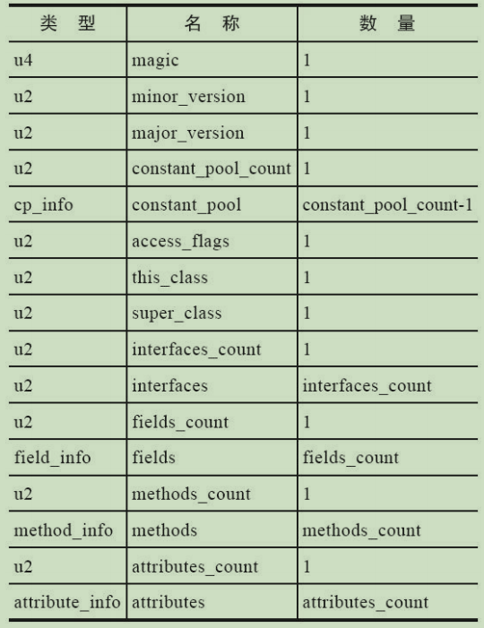

    无论是无符号数还是表，当需要描述同一类型但数量不定的多个数据时，经常会使用一个前置的容量计数器加若干个连续的数据项的形式，这时候称这一系列连续的某一类型的数据为某一类型的“集合”。

+ 魔数：每个Class文件的头4个字节被称为魔数（Magic Number），它的唯一作用是确定这个文件是否为一个能被虚拟机接受的Class文件。文件格式的制定者可以自由地选择魔数值，只要这个魔数值还没有被广泛采用过而且不会引起混淆。Class文件的魔数取得很有“浪漫气息”，值为0xCAFEBABE（咖啡宝贝？）。

+ Class 文件的版本：第5和第6个字节是次版本号（Minor Version），第7和第8个字节是主版本号（Major Version）。

+ 常量池：常量池可以比喻为Class文件里的资源仓库，它是Class文件结构中与其他项目关联最多的数据，通常也是占用Class文件空间最大的数据项目之一。由于常量池中常量的数量是不固定的，所以在常量池的入口需要放置一项u2类型的数据，代表常量池容量计数值（constant_pool_count）。与Java中语言习惯不同，这个容量计数是从1而不是0开始的。这样做的目的在于，如果后面某些指向常量池的索引值的数据在特定情况下需要表达“不引用任何一个常量池项目”的含义，可以把索引值设置为0来表示。常量池中主要存放两大类常量：字面量（Literal）和符号引用（Symbolic References）。常量池中每一项常量都是一个表，截至JDK13，常量表中分别有17种不同类型的常量。这17类表都有一个共同的特点，表结构起始的第一位是个u1类型的标志位（tag，取值见表6-3中标志列），代表着当前常量属于哪种常量类型。17种常量类型：

  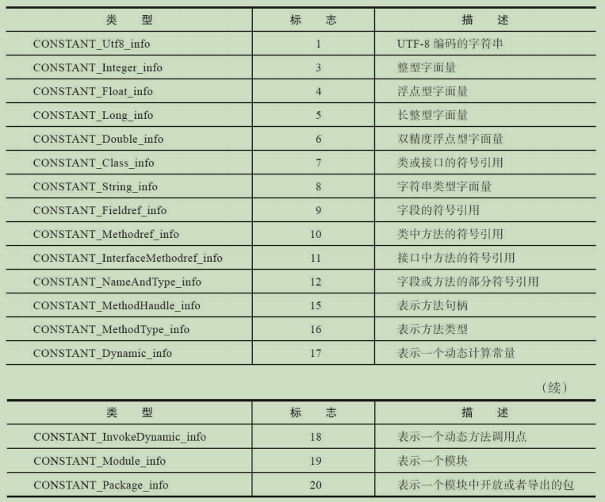

+ 访问标志：用于识别一些类或者接口层次的访问信息，包括：这个Class是类还是接口；是否定义为public类型；是否定义为abstract类型；如果是类的话，是否被声明为final；

  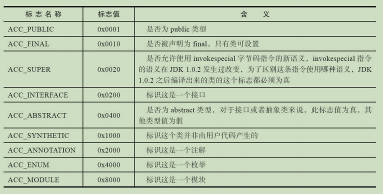

+ 类索引、父类索引与接口索引集合：类索引（this_class）和父类索引（super_class）都是一个u2类型的数据，而接口索引集合（interfaces）是一组u2类型的数据的集合，Class文件中由这三项数据来确定该类型的继承关系。

  

+ 字段表集合：字段表（field_info）用于描述接口或者类中声明的变量。

  

  字段修饰符放在access_flags项目中，跟随access_flags标志的是两项索引值：name_index descriptor_index。它们都是对常量池项的引用，分别代表着字段的简单名称以及字段和方法的描述符。

+ 方法表集合：Class文件存储格式中对方法的描述与对字段的描述采用了几乎完全一致的方式，方法表的结构如同字段表一样，依次包括访问标志（access_flags）、名称索引（name_index）、描述符索引（descriptor_index）、属性表集合（attributes）几项，如表6-11所示。

  

+ 属性表集合：属性表（attribute_info）在前面的讲解之中已经出现过数次，Class文件、字段表、方法表都可以携带自己的属性表集合，以描述某些场景专有的信息。部分属性表如下：

  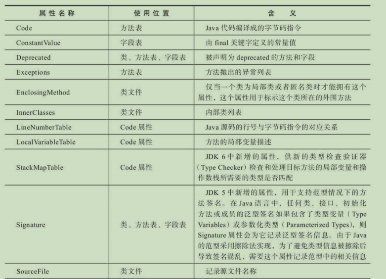

  对于每一个属性，它的名称都要从常量池中引用一个CONSTANT_Utf8_info类型的常量来表示，而属性值的结构则是完全自定义的，只需要通过一个u4的长度属性去说明属性值所占用的位数即可。

  

字节码指令简介：由于Java虚拟机采用面向操作数栈而不是面向寄存器的架构，所以大多数指令都不包含操作数，只有一个操作码（一个字节），指令参数都存放在操作数栈中。由于Class文件格式放弃了编译后代码的操作数长度对齐，这就意味着虚拟机在处理那些超过一个字节的数据时，不得不在运行时从字节中重建出具体数据的结构；放弃了操作数长度对齐，就意味着可以省略掉大量的填充和间隔符号；用一个字节来代表操作码，也是为了尽可能获得短小精干的编译代码。

+ 字节码和数据类型：大多数指令都包含其操作所对应的数据类型信息，如iload，fload。大部分指令都没有支持整数类型byte、char和short，甚至没有任何指令支持boolean类型。编译器会在编译期或运行期将byte和short类型的数据带符号扩展（Sign-Extend）为相应的int类型数据，将boolean和char类型数据零位扩展（Zero-Extend）为相应的int类型数据。
+ 加载和存储指令：`iload、iload_<n>、，istore、istore_<n>`等
+ 运算指令：算术指令用于对两个操作数栈上的值进行某种特定运算，并把结果重新存入到操作栈顶。分为两种：对整型数据进行运算的指令与对浮点型数据进行运算的指令。换句话说是不存在直接支持byte、short、char和boolean类型的算术指令，对于上述几种数据的运算，应使用操作int类型的指令代替。指令有：`iadd、ladd、fadd、dadd`等。Java虚拟机在进行浮点数运算时，所有的运算结果都必须舍入到适当的精度，非精确的结果必须舍入为可被表示的最接近的精确值；如果有两种可表示的形式与该值一样接近，那将优先选择最低有效位为零的；而在把浮点数转换为整数时，Java虚拟机使用IEEE 754标准中的向零舍入模式，这种模式的舍入结果会导致数字被截断，所有小数部分的有效字节都会被丢弃掉。
+ 类型转换指令：Java虚拟机直接支持（即转换时无须显式的转换指令）宽化类型转换（即小范围类型向大范围类型的安全转换），处理窄化类型转换（Narrowing Numeric Conversion）时，就必须显式地使用转换指令来完成，这些转换指令包括i2b、i2c、i2s、l2i、f2i、f2l、d2i、d2l和d2f。在将int或long类型窄化转换为整数类型T的时候，转换过程仅仅是简单丢弃除最低位N字节以外的内容，N是类型T的数据类型长度，这将可能导致转换结果与输入值有不同的正负号。
+ 对象创建和访问指令：对象创建后，就可以通过对象访问指令获取对象实例或者数组实例中的字段或者数组元素，这些指令包括：
  + 创建类实例的指令：new
  + 创建数组的指令：newarray、anewarray、multianewarray
  + 访问类字段（static字段，或者称为类变量）和实例字段（非static字段，或者称为实例变量）的指令：getfield、putfield、getstatic、putstatic
  + 把一个数组元素加载到操作数栈的指令：baload、caload、saload、iaload、laload、faload、daload、aaload
  + 将一个操作数栈的值储存到数组元素中的指令：bastore、castore、sastore、iastore、fastore、dastore、aastore
  + 取数组长度的指令：arraylength
  + 检查类实例类型的指令：instanceof、checkcast
+ 操作数栈管理指令：`pop，dup，swap`等
+ 控制转移指令：`ifeq，ret，if_icmpeq`等
+ 方法调用和返回指令：
  + invokevirtual指令：用于调用对象的实例方法，根据对象的实际类型进行分派（虚方法分派），这也是Java语言中最常见的方法分派方式。
  + invokeinterface指令：用于调用接口方法，它会在运行时搜索一个实现了这个接口方法的对象，找出适合的方法进行调用。
  + invokespecial指令：用于调用一些需要特殊处理的实例方法，包括实例初始化方法、私有方法和父类方法。
  + invokestatic指令：用于调用类静态方法（static方法）。
  + invokedynamic指令：用于在运行时动态解析出调用点限定符所引用的方法。并执行该方法。前面四条调用指令的分派逻辑都固化在Java虚拟机内部，用户无法改变，而invokedynamic指令的分派逻辑是由用户所设定的引导方法决定的。
+ 异常处理指令：在Java程序中显式抛出异常的操作（throw语句）都由athrow指令来实现。
+ 同步指令：Java虚拟机可以支持方法级的同步和方法内部一段指令序列的同步，这两种同步结构都是使用管程（Monitor，更常见的是直接将它称为“锁”）来实现的。当方法调用时，调用指令将会检查方法的ACC_SYNCHRONIZED访问标志是否被设置，如果设置了，执行线程就要求先成功持有管程，然后才能执行方法，最后当方法完成（无论是正常完成还是非正常完成）时释放管程。同步一段指令集序列通常是由Java语言中的synchronized语句块来表示的，Java虚拟机的指令集中有monitorenter和monitorexit两条指令来支持synchronized关键字的语义。

公有设计，私有实现：《Java虚拟机规范》描绘了Java虚拟机应有的共同程序存储格式：Class文件格式以及字节码指令集。但一个优秀的虚拟机实现，在满足《Java虚拟机规范》的约束下对具体实现做出修改和优化也是完全可行的。虚拟机实现的方式主要有以下两种：
+ 将输入的Java虚拟机代码在加载时或执行时翻译成另一种虚拟机的指令集；
+ 将输入的Java虚拟机代码在加载时或执行时翻译成宿主机处理程序的本地指令集（即即时编译器代码生成技术）

Class文件结构的发展：相对于语言、API以及Java技术体系中其他方面的变化，Class文件结构一直处于一个相对比较稳定的状态，Class文件的主体结构、字节码指令的语义和数量几乎没有出现过变动，所有对Class文件格式的改进，都集中在访问标志、属性表这些设计上原本就是可扩展的数据结构中添加新内容。


## 第七章 虚拟机类加载机制

概述：Java虚拟机把描述类的数据从Class文件加载到内存，并对数据进行校验、转换解析和初始化，最终形成可以被虚拟机直接使用的Java类型，这个过程被称作虚拟机的类加载机制。与那些在编译时需要进行连接的语言不同，在Java语言里面，类型的加载、连接和初始化过程都是在程序运行期间完成的，这种策略让Java语言进行提前编译会面临额外的困难，也会让类加载时稍微增加一些性能开销，但是却为Java应用提供了极高的扩展性和灵活性。

类加载的时机：一个类的整个生命周期如下：

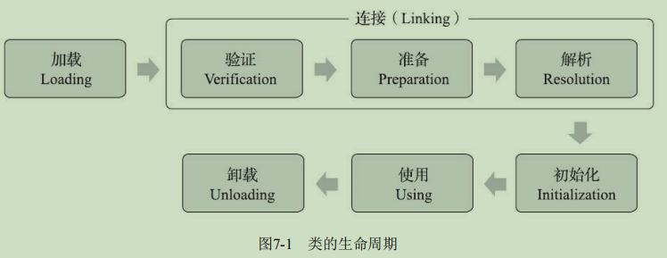

加载、验证、准备、初始化和卸载这五个阶段的顺序是确定的，而解析阶段则不一定：它在某些情况下可以在初始化阶段之后再开始，这是为了支持Java语言的运行时绑定特性（也称为动态绑定或晚期绑定）。但是对于初始化阶段，《Java虚拟机规范》则是严格规定了有且只有六种情况必须立即对类进行“初始化”（而加载、验证、准备自然需要在此之前开始）：

1. 遇到new、getstatic、putstatic或invokestatic这四条字节码指令时，如果类型没有进行过初始化，则需要先触发其初始化阶段。如使用new关键字，读取或设置一个类的静态字段，调用一个类的静态方法。
2. 使用java.lang.reflect包的方法对类型进行反射调用的时候，如果类型没有进行过初始化，则需要先触发其初始化。
3. 当初始化类的时候，如果发现其父类还没有进行过初始化，则需要先触发其父类的初始化。
4. 当虚拟机启动时，用户需要指定一个要执行的主类（包含main()方法的那个类），虚拟机会先初始化这个主类。
5. 如果一个java.lang.invoke.MethodHandle实例最后的解析结果为REF_getStatic、REF_putStatic、REF_invokeStatic、REF_newInvokeSpecial四种类型的方法句柄，并且这个方法句柄对应的类没有进行过初始化，则需要先触发其初始化。
6. 当一个接口中定义了JDK 8新加入的默认方法（被default关键字修饰的接口方法）时，如果有这个接口的实现类发生了初始化，那该接口要在其之前被初始化。

类加载过程：加载、验证、准备、解析和初始化这五个阶段所执行的具体动作。

+ 加载：
  + 通过一个类的全限定名来获取定义此类的二进制字节流。
  + 将这个字节流所代表的静态存储结构转化为方法区的运行时数据结构。
  + 在内存中生成一个代表这个类的java.lang.Class对象，作为方法区这个类的各种数据的访问入口。
+ 验证：这一阶段的目的是确保Class文件的字节流中包含的信息符合《Java虚拟机规范》的全部约束要求，保证这些信息被当作代码运行后不会危害虚拟机自身的安全。
  + 文件格式验证
  + 元数据验证：这个类的父类是否继承了不允许被继承的类；如果这个类不是抽象类，是否实现了其父类或接口之中要求实现的所有方法
  + 字节码验证：这阶段就要对类的方法体（Class文件中的Code属性）进行校验分析，如保证任何跳转指令都不会跳转到方法体以外的字节码指令上，保证方法体中的类型转换总是有效的等。
  + 符号引用验证：验证该类是否缺少或者被禁止访问它依赖的某些外部类、方法、字段等资源。如符号引用中的类、字段、方法的可访问性（`private、protected、public、<package>`）是否可被当前类访问等。
+ 准备：是正式为**类中定义的变量**（即静态变量，被static修饰的变量）分配内存并设置类变量初始值的阶段。需要注意的是如果是`static int value = 123`，准备阶段的初始值是0而不是123，因为这时尚未开始执行任何Java方法，而把value赋值为123的putstatic指令是程序被编译后，存放于类构造器`<clinit>()`方法之中的；但是如果是`public static final int value = 123`，那么准备阶段的值就是123。
+ 解析：是Java虚拟机将常量池内的符号引用替换为直接引用的过程。
  + 类或接口的解析：如果C不是一个数组类型，那虚拟机将会把代表N的全限定名传递给D的类加载器去加载这个类C。在加载过程中，由于元数据验证、字节码验证的需要，又可能触发其他相关类的加载动作，例如加载这个类的父类或实现的接口。一旦这个加载过程出现了任何异常，解析过程就将宣告失败。成功的话，那么C在虚拟机中实际上已经成为一个有效的类或接口了，但在解析完成前还要进行符号引用验证，确认D是否具备对C的访问权限。
  + 字段解析
  + 方法解析
  + 接口方法解析
+ 初始化：直到初始化阶段，Java虚拟机才真正开始执行类中编写的Java程序代码，将主导权移交给应用程序。初始化阶段就是执行类构造器`<clinit>()`方法的过程。`<clinit>()`并不是程序员在Java代码中直接编写的方法，它是Javac编译器的自动生成物。`<clinit>()`方法是由编译器自动收集类中的所有类变量的赋值动作和静态语句块（static{}块）中的语句合并产生的，编译器收集的顺序是由语句在源文件中出现的顺序决定的，静态语句块中只能访问到定义在静态语句块之前的变量。Java虚拟机会保证在子类的`<clinit>()`方法执行前，父类的`<clinit>()`方法已经执行完毕。

类加载器：Java虚拟机设计团队有意把类加载阶段中的“通过一个类的全限定名来获取描述该类的二进制字节流”这个动作放到Java虚拟机外部去实现，以便让应用程序自己决定如何去获取所需的类。实现这个动作的代码被称为“类加载器”（Class Loader）。

+ 类与类加载器：比较两个类是否“相等”，只有在这两个类是由同一个类加载器加载的前提下才有意义，否则，即使这两个类来源于同一个Class文件，被同一个Java虚拟机加载，只要加载它们的类加载器不同，那这两个类就必定不相等。

+ 双亲委派模型：

  + 三层类加载器：

    + 启动类加载器：这个类加载器负责加载存放在`<JAVA_HOME>\lib`目录，是Java虚拟机能够识别的（按照文件名识别，如rt.jar、tools.jar，名字不符合的类库即使放在lib目录中也不会被加载）类库加载到虚拟机的内存中。
    + 扩展类加载器：负责加载<JAVA_HOME>\lib\ext目录中，或者被java.ext.dirs系统变量所指定的路径中所有的类库。
    + 应用程序类加载器：由于应用程序类加载器是ClassLoader类中的getSystemClassLoader()方法的返回值，所以有些场合中也称它为“系统类加载器”。它负责加载用户类路径（ClassPath）上所有的类库，开发者同样可以直接在代码中使用这个类加载器。

    JDK 9之前的Java应用都是由这三种类加载器互相配合来完成加载的，如果用户认为有必要，还可
    以加入自定义的类加载器来进行拓展：

    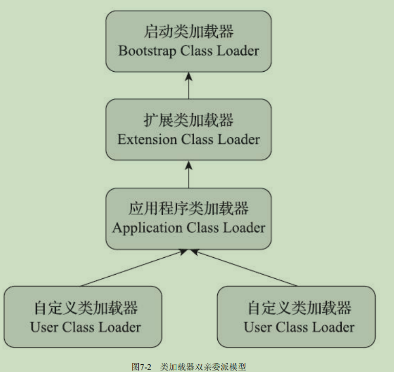

  + 双亲委派模型：如果一个类加载器收到了类加载的请求，它首先不会自己去尝试加载这个类，而是把这个请求委派给父类加载器去完成，每一个层次的类加载器都是如此，因此所有的加载请求最终都应该传送到最顶层的启动类加载器中，只有当父加载器反馈自己无法完成这个加载请求（它的搜索范围中没有找到所需的类）时，子加载器才会尝试自己去完成加载。好处是Java中的类随着它的类加载器一起具备了一种带有优先级的层次关系。

Java模块化系统：

+ 模块的兼容性：JDK 9提出了与“类路径”（ClassPath）相对应的“模块路径”（ModulePath）的概念。简单来说，就是某个类库到底是模块还是传统的JAR包，只取决于它存放在哪种路径上。有如下访问规则：

  + JAR文件在类路径的访问规则：所有类路径下的JAR文件及其他资源文件，都被视为自动打包在一个匿名模块（Unnamed Module）里，这个匿名模块几乎是没有任何隔离的，它可以看到和使用类路径上所有的包、JDK系统模块中所有的导出包，以及模块路径上所有模块中导出的包。
  + 模块在模块路径的访问规则：模块路径下的具名模块（Named Module）只能访问到它依赖定义中列明依赖的模块和包，匿名模块里所有的内容对具名模块来说都是不可见的，即具名模块看不见传统JAR包的内容。
  + JAR文件在模块路径的访问规则：如果把一个传统的、不包含模块定义的JAR文件放置到模块路径中，它就会变成一个自动模块（Automatic Module）。尽管不包含module-info.class，但自动模块将默认依赖于整个模块路径中的所有模块，因此可以访问到所有模块导出的包，自动模块也默认导出自己所有的包。

+ 模块下的类加载器：JDK 9并没有从根本上动摇从JDK 1.2以来运行了二十年之久的三层类加载器架构以及双亲委派模型。但是为了模块化系统的顺利施行，模块化下的类加载器仍然发生了一些应该被注意到变动，主要包括以下几个方面：

  + 扩展类加载器被平台类加载器取代
  + 平台类加载器和应用程序类加载器都不再派生自java.net.URLClassLoader，现在启动类加载器、平台类加载器、应用程序类加载器全都继承于jdk.internal.loader.BuiltinClassLoader，在BuiltinClassLoader中实现了新的模块化架构下类如从模块中加载的逻辑，以及模块中资源可访问性的处理
  + JDK 9中虽然仍然维持着三层类加载器和双亲委派的架构，但类加载的委派关系也发生了变动。当平台及应用程序类加载器收到类加载请求，在委派给父加载器加载前，要先判断该类是否能够归属到某一个系统模块中，如果可以找到这样的归属关系，就要优先委派给负责那个模块的加载器完成加载

  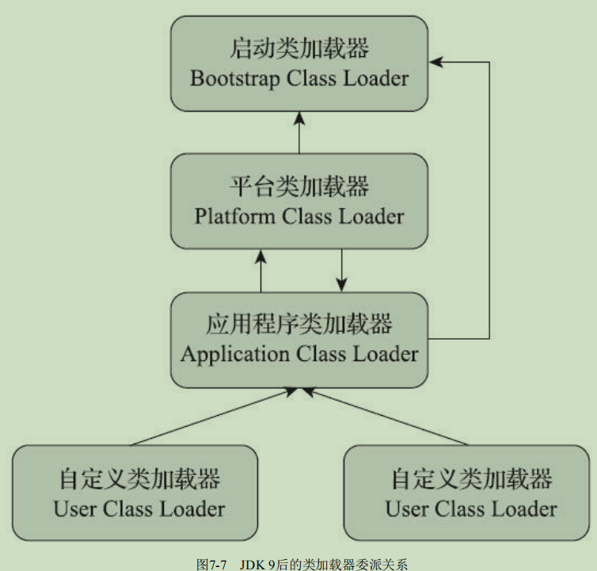


## 第八章 虚拟机字节码执行引擎

运行时栈帧结构：下图是 JVM 的栈和栈帧的总体结构：

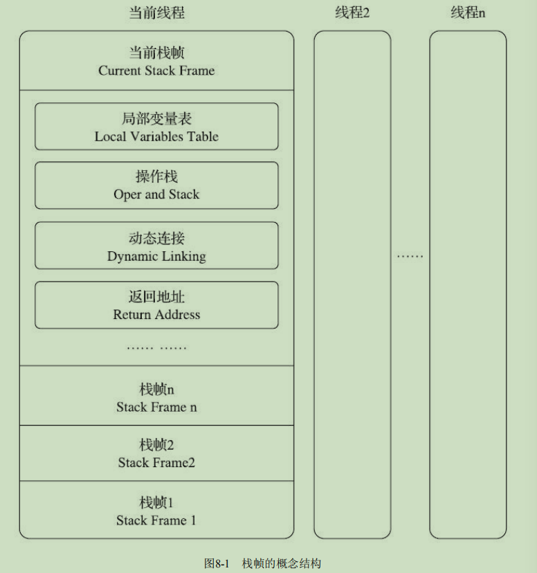

每个栈帧里面包含有局部变量表、操作数栈、动态连接、方法返回地址和一些额外的附加信息。

+ 局部变量表：是一组变量值的存储空间，用于存放方法参数和方法内部定义的局部变量。变量槽空间一般是 32 位，对于long类型的变量，需要两个槽来保存。当方法被调用的时候，首先存储相关的实参，然后再存储方法内部的局部变量。比如，对于实例方法，局部变量表第0位代表的就是方法所属对象的引用，方法中通过 this 隐式访问到。另外，局部变量表中的变量槽可以被重用，这可能会带来副作用，如 gc 过程。最后，局部变量没有所谓的“准备阶段”，因此，对局部变量引用前需要先赋值。

+ 操作数栈：用于保存相应的操作数。在进行运算的时候需要检查指令和对应的数据类型是否匹配。在概念模型上，两个不同的栈帧是完全相互独立的，但是在实际过程中，可能存在重合，这样做的好处是节约空间，同时无需进行额外的实参-形参转换。

  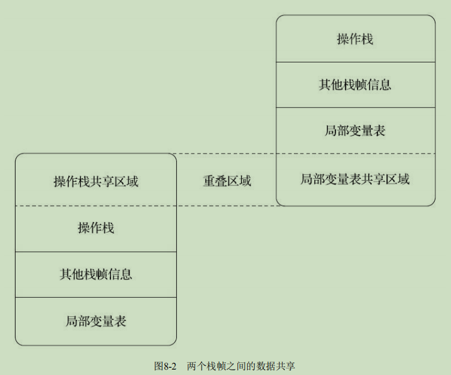

+ 动态链接：每个栈帧都包含一个指向运行时常量池[1]中该栈帧所属方法的引用，持有这个引用是为了支持方法调用过程中的动态连接（Dynamic Linking）。

+ 方法返回地址：正常返回上层方法调用者，可能会提供返回值，异常返回的话，不带任何返回值。推出的过程实际上等同于将当前栈帧出栈。

方法调用：

+ 解析：在类加载的过程中，如果方法的调用版本在运行期不可变，就可以将方法的符号引用转化为直接引用，该类方法的调用称为解析。在 Java 中，这样的方法有静态方法，私有方法，实例构造器，父类方法，final 方法。这些方法称为“非虚方法”，其他的就成为“虚方法”。

+ 分派（dispatch）：

  + 静态分派：假设 `Human man = new Man()`，那么Human成为变量的静态类型，或者是外观类型，后面的Man则称为变量的实际类型或者运行时类型。所有依赖静态类型来决定方法执行版本的分派动作，都称为静态分派。静态分派的最典型应用表现就是方法重载。静态分派发生在编译阶段。虽然编译器能够在确定方法重载版本，但是实际上只是选择一个相对更合适的版本。假设有一个类实现了sayHello方法，重载了所有类型的参数。那么对应`sayHello('a')`中的a的类型被解析为char，如果注释掉char类型的重载，那么a会被解析成int类型，依次往后是：Character，Serializable(Character的一个接口)，Object（父类），变长参数。

  + 动态分派：与重写有关。`Human man = new Man()`，man执行重写方法的时候，会执行`Man`类里面的对应的方法，而不是`Woman`里面的重载方法，这与变量的实际类型有关。调用重写方法的时候，执行指令是`invokevirtual`，其运行过程如下：

    1. 找到变量指向对象的实际类型，记做C
    2. 如果在C中找到与方法签名一直的方法，进行访问权限校验，通过直接返回这个方法的直接调用，否则返回`java.lang.IllegalAccessError`
    3. 否则，按照继承关系从下往上依次对C的各个父类进行2操作
    4. 如果始终没有找到合适方法，抛出`java.lang.AbstractMethodError`异常

    注意，方法存在多态，但是字段不存在多态。

+ 虚拟机动态分派的实现：通常虚拟机会创建一个虚方法表（vtable，对应的还有接口方法表itable），使用虚方法表索引来代替元数据查找以提高性能。

  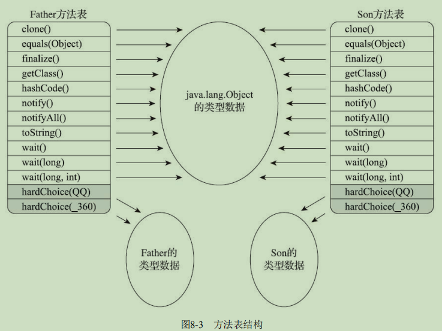

动态类型语言支持：

+ 动态类型语言：动态类型语言的关键特征是它的类型检查的主体过程是在运行期而不是编译期进行的，如Javascript等。那相对地，在编译期就进行类型检查过程的语言，譬如C++和Java等就是最常用的静态类型语言。

+ Java与动态类型：在 Java7 之前的4条方法调用指令（`invoke*`）的第一个参数都是被调用方法的符号引用。前面已经提到过，方法的符号引用在编译时产生，而动态类型语言只有在运行期才能确定方法的接收者。这样，在Java虚拟机上实现的动态类型语言就不得不使用“曲线救国”的方式（如编译时留个占位符类型，运行时动态生成字节码实现具体类型到占位符类型的适配）来实现，但这样势必会让动态类型语言实现的复杂度增加，也会带来额外的性能和内存开销。

+ `java.lang.invoke`：该包提供了一种新的动态确定方法的机制，称为方法句柄。

  ```java
  import static java.lang.invoke.MethodHandles.lookup;
  import java.lang.invoke.MethodHandle;
  import java.lang.invoke.MethodType;
  
  public class MethodHandleTest {
      static class ClassA {
          public void println(String s) {
          System.out.println(s);
          }
      }
  	public static void main(String[] args) throws Throwable {
          Object obj = System.currentTimeMillis() % 2 == 0 ? System.out : new ClassA();
          // 无论obj最终是哪个实现类，下面这句都能正确调用到println方法。
          getPrintlnMH(obj).invokeExact("icyfenix");
      }
      private static MethodHandle getPrintlnMH(Object reveiver) throws Throwable {
          // MethodType：代表“方法类型”，包含了方法的返回值（methodType()的第一个参数）和具体参数（methodType()第二个及以后的参数）。
          MethodType mt = MethodType.methodType(void.class, String.class);
          // lookup()方法来自于MethodHandles.lookup，这句的作用是在指定类中查找符合给定的方法名称、方法类型，并且符合调用权限的方法句柄。
          // 因为这里调用的是一个虚方法，按照Java语言的规则，方法第一个参数是隐式的，代表该方法的接收者，也即this指向的对象，这个参数以前是放在参数列表中进行传递，现在提供了bindTo()方法来完成这件事情。
          return lookup().findVirtual(reveiver.getClass(), "println", mt).bindTo(reveiver);
      }
  }
  ```

  MethodHandle在使用方法和效果上与Reflection有众多相似之处。不过，它们也有以下这些区别：

  + Reflection和MethodHandle机制本质上都是在模拟方法调用，但是Reflection是在模拟Java代码层次的方法调用，而MethodHandle是在模拟字节码层次的方法调用。
  + Reflection中的java.lang.reflect.Method对象远比MethodHandle机制中的java.lang.invoke.MethodHandle对象所包含的信息来得多。
  + Reflection API的设计目标是只为Java语言服务的，而MethodHandle则设计为可服务于所有Java虚拟机之上的语言。

+ invokedynamic指令：作为Java诞生以来唯一一条新加入的字节码指令，都是为了解决原有4条“invoke*”指令方法分派规则完全固化在虚拟机之中的问题，把如何查找目标方法的决定权从虚拟机转嫁到具体用户代码之中。invokedynamic指令的第一个参数不再是代表方法符号引用的CONSTANT_Methodref_info常量，而是变为JDK 7
  时新加入的CONSTANT_InvokeDynamic_info常量，从这个新常量中可以得到3项信息：引导方法
  （Bootstrap Method，该方法存放在新增的BootstrapMethods属性中）、方法类型（MethodType）和
  名称。

+ 掌控方法分派规则：子类方法不能直接调用祖父类方法，可以通过MethodHandle来进行访问，如遇到权限问题，可以使用`lookupImpl.setAccessible(true)`来解决。

基于栈的字节码解释执行引擎：

+ 解释执行：Java语言被定为解释执行的语言，这在JDK1.0时代算是准确的，但是之后Java也发展出了可以生成本地代码的编译器，这个时候说Java是解释执行的语言就不再准确了。下图中间分支指代解释执行过程，最下面分支指代编译执行过程：

  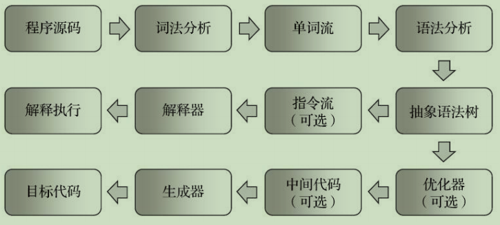

+ 基于栈的指令集与基于寄存器的指令集：Java指令基于栈结构，x86指令基于寄存器，使用栈结构带来的好处是可移植性更强，缺点是运行速度慢。

  

## 第九章 类加载案例

案例分析：

+ Tomcat：在Tomcat中一种有四种目录存放Java类库：

  1. 放置在/common目录中。类库可被Tomcat和所有的Web应用程序共同使用。
  2. 放置在/server目录中。类库可被Tomcat使用，对所有的Web应用程序都不可见。
  3. 放置在/shared目录中。类库可被所有的Web应用程序共同使用，但对Tomcat自己不可见。
  4. 放置在/WebApp/WEB-INF目录中。类库仅仅可以被该Web应用程序使用，对Tomcat和其他Web应用程序都不可见。

  为了支持这套目录，并且对目录里面的类库进行加载和隔离，Tomcat实现了自定义的类加载器，按照双亲委派模型：

  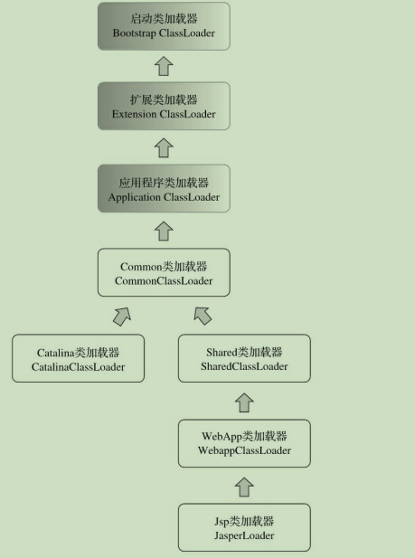

  在Tomcat6之后，只有指定了tomcat/conf/catalina.properties配置文件的server.loader和share.loader项后才会真正建立Catalina类加载器和Shared类加载器的实例，否则会用到这两个类加载器的地方都会用Common类加载器的实例代替。同时前文提到的前三个目录也会被改为一个/lib目录。

+ OSGi：是OSGi联盟（OSGi Alliance）制订的一个基于Java语言的动态模块化规范。OSGi中的每个模块（Bundle）可以声明它所依赖的Package（通过Import-Package描述），也可以声明它允许导出发布的Package（通过Export-Package描述）。这和后来出现的Java模块化功能重合了。由于模块之间相依依赖的原因，加载器之间的关系不再是双亲委派模型的树形结构，而是已经进一步发展成一种更为复杂的、运行时才能确定的网状结构。在模块中相互依赖会造成死锁。

+ Backport工具：将高级的Java语法转化为低版本Java也能运行的语句代码的工具。


